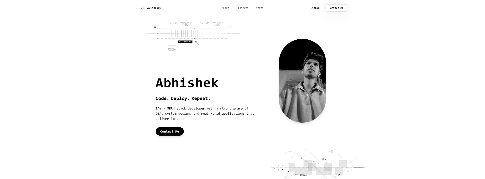
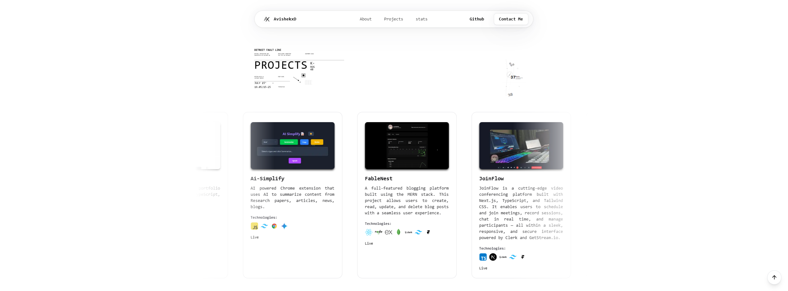

# Abhishek Meena — Portfolio

A futuristic, immersive portfolio built using 
This is my Personal Portfolio Website, built with **Next.js**, **TypeScript**,**Framer-motion** and  **TailwindCSS**. The goal of this project is to showcase my skills, projects, and contact details in a visually engaging and modern interface. It is fully responsive, performs well, and uses reusable components to maintain clean, scalable code.

---

## 📸 Screenshots




---

## 📁 Folder Structure

```txt
PERSONAL-PORTFOLIO/
├── .next/                      
├── components/               
├── lib/                      
├── node_modules/              
├── public/                    
├── src/                       
│   └── app/                  
│       ├── api/              
│       ├── globals.css       
│       ├── layout.tsx      
│       ├── not-found.tsx      
│       ├── page.tsx          
│       ├── about.tsx          
│       ├── contact.tsx      
│       ├── projects.tsx     
│       └── statspage.tsx      
├── styles/              
├── .vscode/                 
├── .env.local         
├── .gitignore                
├── components.json          
├── eslint.config.mjs        
├── next-env.d.ts           
├── next.config.ts             
├── package.json               
├── package-lock.json          
├── postcss.config.mjs      
├── package-lock.json          
├── tailwind.config.js  
├── tsconfig.json          
└── README.md                 
```